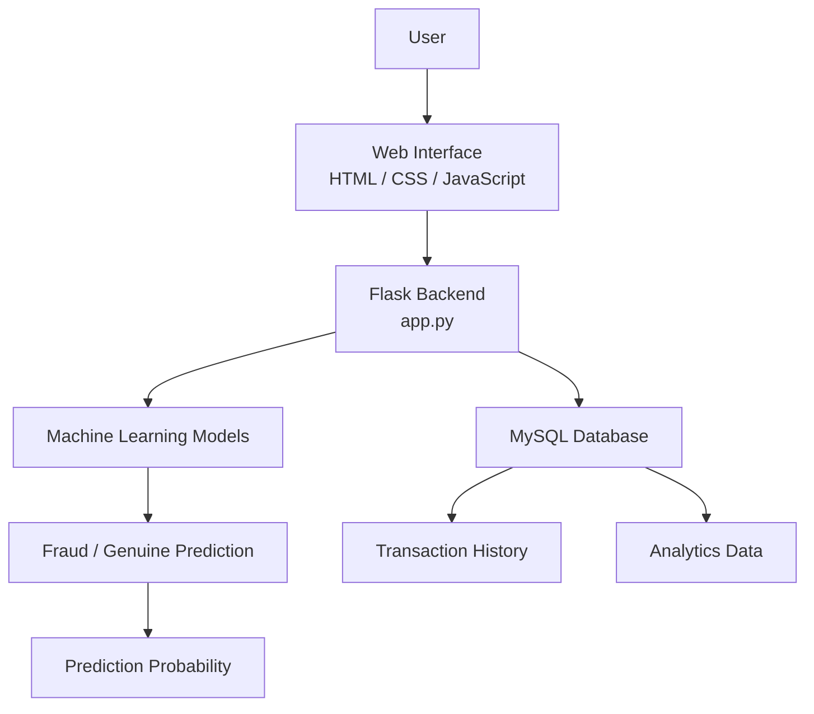
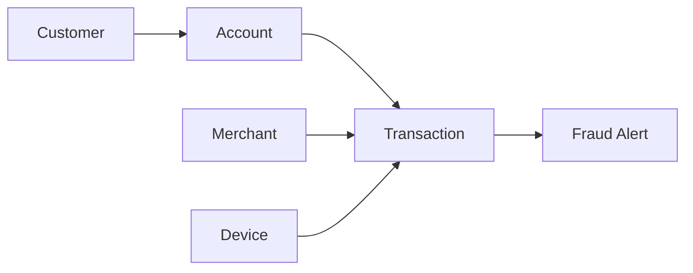

# 🛡️ AI-Based Fraud Transaction Detection & Analytics System
 
An intelligent machine-learning-based web application for detecting potentially fraudulent financial transactions and providing transaction analytics through a Flask and MySQL web platform.
 
The system combines **Machine Learning, Flask, MySQL, HTML/CSS/JavaScript, and Chart.js** to support fraud prediction, transaction management, customer-related data, and analytical insights.
 
> **Academic project:** This system is intended for learning, demonstration, and academic use. It is not a certified financial fraud-prevention or production banking system.
 
---
 
## 📌 Table of Contents
 
- [Project Overview](#-project-overview)
- [Objectives](#-objectives)
- [Key Features](#-key-features)
- [Machine Learning](#-machine-learning)
- [System Architecture](#-system-architecture)
- [Technology Stack](#-technology-stack)
- [Project Structure](#-project-structure)
- [Database Design](#-database-design)
- [Getting Started](#-getting-started)
- [Configuration](#-configuration)
- [Fraud Detection Workflow](#-fraud-detection-workflow)
- [Application Modules](#-application-modules)
- [Security and Data Protection](#-security-and-data-protection)
- [Datasets](#-datasets)
- [Future Enhancements](#-future-enhancements)
- [Contributors](#-contributors)
- [License](#-license)
- [Acknowledgements](#-acknowledgements)
 
---
 
## 📌 Project Overview
 
Financial fraud is a major challenge in modern digital transactions. This project uses machine learning techniques to analyze transaction-related features and classify transactions as:
 
- ✅ **Genuine Transaction**
- 🚨 **Fraudulent Transaction**
 
The application allows a user to enter transaction details, choose a trained machine-learning model, and receive a prediction with the associated probability returned by the selected model.
 
The application also stores transaction-related information in MySQL and provides transaction history and analytics views.
 
---
 
## 🎯 Objectives
 
- Detect potentially fraudulent transactions using machine-learning classification models.
- Provide a simple and user-friendly fraud-detection interface.
- Store and manage customer, account, transaction, device, merchant, and fraud-alert data using MySQL.
- Maintain transaction history for later analysis.
- Compare multiple machine-learning algorithms.
- Display the prediction and model probability where supported by the selected classifier.
- Demonstrate the integration of machine learning with a web application and relational database.
 
---
 
## ✨ Key Features
 
### 🔍 Fraud Detection
 
- Fraud / genuine transaction classification.
- Multiple machine-learning model options.
- Prediction probability.
- Input preprocessing and feature encoding before inference.
 
### 👤 Customer Management
 
- Existing customer selection.
- Support for entering new customer transaction details.
- Retrieval of customer-related information from the database.
- Association of transactions with customer and account data.
 
### 💳 Transaction Processing
 
The transaction interface supports fields such as:
 
- Transaction amount.
- Transaction type.
- Merchant.
- Transaction time.
- International transaction indicator.
- New-device indicator.
- Other model features required by the training pipeline.
 
### 📊 Analytics
 
The analytics module is designed to provide insights such as:
 
- Total transaction statistics.
- Fraud transaction analysis.
- Transaction-type distribution.
- Merchant-based analysis.
- Location-based analysis.
- Transaction amount analysis.
- Risk-related information.
 
### 🗄️ Database Management
 
MySQL is used to persist application data related to:
 
- Customers
- Accounts
- Devices
- Merchants
- Transactions
- Fraud alerts
 
---
 
## 🧠 Machine Learning
 
The project uses multiple supervised machine-learning classifiers for fraud classification.
 
### Models Included
 
| Model | Role |
|---|---|
| Tuned XGBoost | Primary high-performance model |
| Random Forest | Ensemble classification model |
| Logistic Regression | Baseline linear classifier |
| Decision Tree | Tree-based classifier |
 
### Preprocessing Artifacts
 
The trained models and preprocessing artifacts are stored in the `models/` directory. Depending on the training pipeline, these may include:
 
- One-hot encoder
- Target encoder
- Feature scaler
- Trained classifier objects
- Other serialized preprocessing or model artifacts
 
### ML Pipeline
 
```text
Transaction Input
       ↓
Feature Preparation
       ↓
Data Preprocessing
       ↓
Feature Encoding / Scaling
       ↓
Trained ML Model
       ↓
Fraud Prediction
       ↓
Prediction Probability
       ↓
Result Display
```
 
> **Note:** Model probability is model-dependent. The exact interpretation of a probability score should be treated as a model output, not as a guaranteed real-world likelihood of fraud.
 
---
 
## 🏗️ System Architecture
 

 
The web interface collects transaction information and sends it to the Flask backend. Flask prepares the input, invokes the selected machine-learning model, returns the prediction, and interacts with MySQL for persistent application data.
 
---
 
## 🛠️ Technology Stack
 
### Programming & Backend
 
- Python
- Flask
 
### Machine Learning & Data Processing
 
- Scikit-learn
- XGBoost
- Pandas
- NumPy
- Joblib
 
### Frontend
 
- HTML5
- CSS3
- JavaScript
- Chart.js
 
### Database
 
- MySQL
- MySQL Connector/Python
 
### Development Tools
 
- Visual Studio Code
- Git
- GitHub
 
---
 
## 📂 Project Structure
 
```text
PREDICTIN_CCARD/
│
├── app.py
├── model.py
├── database.py
├── train_model.py
├── README.md
├── .gitignore
│
├── models/
│   ├── decision_tree.pkl
│   ├── final_xgboost.pkl
│   ├── logistic_regression.pkl
│   ├── random_forest.pkl
│   ├── one_hot_encoder.pkl
│   ├── target_encoder.pkl
│   ├── scaler.pkl
│   └── other model artifacts...
│
├── templates/
│   ├── dashboard.html
│   ├── detect.html
│   ├── transactions.html
│   └── analytics.html
│
├── static/
│   ├── analytics.css
│   ├── analytics.js
│   ├── common.css
│   ├── common.js
│   ├── detect.css
│   ├── fraud.js
│   └── transactions.js
│
└── db/
    └── mydb.sql
```
 
> **Recommendation:** For a public repository, also add a `requirements.txt` file and an `.env.example` file so the environment can be reproduced without exposing secrets.
 
---
 
## 🗄️ Database Design
 
The application database is named `fraud_detection`.
 
### Entity Relationship Overview
 
The project follows this high-level relationship structure:
 

 
### Main Relationships
 
```text
Customer
   │
   └── Account
          │
          └── Transaction
                ├── Merchant
                ├── Device
                └── Fraud Alert
```
 
The exact columns and constraints are defined in `db/mydb.sql`.
 
---
 
## 🚀 Getting Started
 
### 1. Clone the Repository
 
Replace the placeholder URL with the actual GitHub repository URL:
 
```bash
git clone <YOUR_GITHUB_REPOSITORY_URL>
cd PREDICTIN_CCARD
```
 
### 2. Create and Activate a Virtual Environment
 
Using a virtual environment is recommended to keep project dependencies isolated.
 
**Windows PowerShell:**
 
```powershell
python -m venv venv
.\venv\Scripts\Activate.ps1
```
 
**Linux / macOS:**
 
```bash
python3 -m venv venv
source venv/bin/activate
```
 
### 3. Install Dependencies
 
```bash
pip install flask mysql-connector-python pandas numpy scikit-learn xgboost joblib
```
 
For reproducible public releases, commit a tested `requirements.txt` file and use:
 
```bash
pip install -r requirements.txt
```
 
### 4. Configure MySQL
 
Create the database:
 
```sql
CREATE DATABASE fraud_detection;
```
 
Then execute the SQL script:
 
```text
db/mydb.sql
```
 
You can run the script from MySQL Workbench or the MySQL command-line client.
 
### 5. Configure Database Credentials
 
Do **not** place passwords directly in `README.md`, source code, or GitHub commits.
 
The application expects the database password through the `DB_PASSWORD` environment variable.
 
**Windows PowerShell:**
 
```powershell
$env:DB_PASSWORD="YOUR_DATABASE_PASSWORD"
```
 
**Linux / macOS:**
 
```bash
export DB_PASSWORD="YOUR_DATABASE_PASSWORD"
```
 
If `database.py` uses additional variables such as database host, user, or database name, configure those variables in the same way according to the application's code.
 
### 6. Prepare the Training Data
 
The large training datasets are intentionally not stored in this repository. Obtain the required datasets separately and place them in the location expected by `train_model.py`.
 
See the [Datasets](#-datasets) section before running the training script.
 
### 7. Run the Application
 
```bash
python app.py
```
 
Open the local application in a browser:
 
```text
http://127.0.0.1:5000
```
 
---
 
## ⚙️ Configuration
 
A public repository should keep secrets outside the source tree.
 
### Recommended `.env.example`
 
If the project is later updated to use a `.env` loader such as `python-dotenv`, a public `.env.example` can contain placeholders like:
 
```env
DB_HOST=localhost
DB_USER=your_mysql_username
DB_PASSWORD=your_mysql_password
DB_NAME=fraud_detection
```
 
The actual `.env` file should remain local and must be included in `.gitignore`.
 
---
 
## 🔄 Fraud Detection Workflow
 
```text
1. User opens the application
          ↓
2. Selects an existing customer or enters new customer details
          ↓
3. Enters transaction information
          ↓
4. Selects a machine-learning model
          ↓
5. Flask receives the transaction input
          ↓
6. Features are prepared and encoded
          ↓
7. The selected trained model performs prediction
          ↓
8. The application obtains the model probability, where supported
          ↓
9. The result is displayed as Fraud or Genuine
          ↓
10. Transaction information can be stored in MySQL
          ↓
11. Transaction history and analytics can be viewed
```
 
---
 
## 📊 Application Modules
 
### 🏠 Dashboard
 
Provides an overview of the fraud-detection system and links to its main functions.
 
### 🔎 Detect Fraud
 
Allows users to enter transaction information, choose a model, and obtain a machine-learning prediction.
 
### 💳 Transactions
 
Displays stored transaction information and transaction history.
 
### 📈 Analytics
 
Provides analytical views related to:
 
- Fraud transactions
- Transaction types
- Merchants
- Locations
- Transaction amounts
- Risk information
 
---
 
## 🔐 Security and Data Protection
 
The project follows basic security practices appropriate for an academic application:
 
- Database credentials should be supplied through environment variables.
- Training datasets are excluded from the public repository.
- Temporary Python files and Python cache files are excluded.
- Environment files such as `.env` should be excluded from version control.
- Sensitive credentials must never be hard-coded into source code or documentation.
 
### ⚠️ Credential Safety
 
If a password or API key has ever been committed to GitHub, simply deleting it from the latest README is **not enough**. Rotate the credential immediately and, when necessary, remove the secret from the repository's Git history.
 
---
 
## 📦 Datasets
 
The following datasets are intentionally excluded from the GitHub repository because of size, licensing, privacy, or repository-management considerations:
 
```text
fraudTrain.csv
fraudTest.csv
credit_card_fraud_dataset.csv
```
 
### Dataset Handling
 
- Store large datasets locally or in an appropriate data-storage system.
- Do not commit private, licensed, or sensitive data without permission.
- Document the dataset source and license before publishing the project publicly.
- Keep the training and testing data separate to avoid accidental data leakage.
 
> **Important:** Update this section with the exact public dataset sources and licenses before treating the repository as a fully reproducible open-source project.
 
---
 
## 🧪 Model Evaluation
 
When comparing the included classifiers, evaluation should not rely only on accuracy because fraud datasets are often highly imbalanced.
 
Recommended metrics include:
 
- Precision
- Recall
- F1-score
- ROC-AUC
- PR-AUC
- Confusion matrix
 
For fraud detection, the cost of false negatives and false positives should be considered when interpreting model performance.
 
---
 
## 🚧 Current Scope and Limitations
 
This project is an academic demonstration of an end-to-end fraud-detection workflow. It should not be treated as a production payment-security platform without additional work in areas such as:
 
- Secure authentication and authorization.
- Input validation and threat modeling.
- Model monitoring and drift detection.
- Threshold calibration and business-rule integration.
- Secure deployment and infrastructure hardening.
- Audit logging.
- Privacy, compliance, and financial-sector regulatory requirements.
- Large-scale real-time transaction processing.
 
---
 
## 🔮 Future Enhancements
 
Possible improvements include:
 
- Real-time fraud monitoring.
- Advanced model explainability using techniques such as SHAP.
- Automated model retraining and model-version management.
- User authentication and role-based authorization.
- Cloud deployment.
- Advanced risk visualization.
- Real-time notification and alerting.
- Model monitoring, drift detection, and threshold tuning.
- API-based integration with external transaction systems.
 
---
 
## 👨‍💻 Contributors
 
| Name | Role | GitHub |
|---|---|---|
| [Shantanu Deshmukh](https://github.com/shantanudeshmukh198) | Author | [github.com/shantanudeshmukh198](https://github.com/shantanudeshmukh198) |
| [Vedant Rajurkar](https://github.com/vedant4122006) | Co-author | [github.com/vedant4122006](https://github.com/vedant4122006) |
| Vishwajit Khade | Co-author | — |
| Sahil Gawande | Co-author | — |
| Prem Watane | Co-author | — |
 
Contributions, suggestions, and improvements can be submitted through GitHub issues and pull requests once the repository is publicly available.
 
---
 
## 📜 License
 
No formal open-source license is specified in the current project information.
 
Before describing this repository as an open-source project, add an appropriate `LICENSE` file (for example, MIT, Apache-2.0, or another license selected by the project owners) and update this section to match the chosen license.
 
---
 
## 🙏 Acknowledgements
 
This project was developed as an academic Machine Learning and DBMS project to demonstrate the practical integration of:
 
- Artificial Intelligence and machine learning
- Web application development
- Relational database management
- Data analysis and visualization
 
---
 
## ⭐ Project Status
 
**Academic / Educational Project**
 
The project demonstrates an end-to-end workflow from transaction input and machine-learning inference to database storage and analytics. Production deployment would require additional security, reliability, data-governance, and model-monitoring controls.
